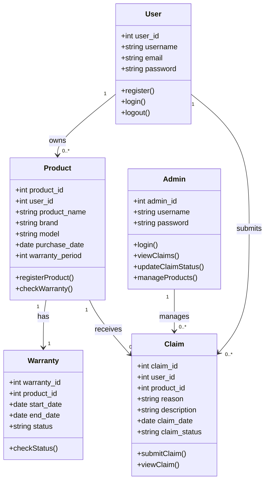

# Class Diagram - Product Warranty Claim Processing Platform

```mermaid
classDiagram

class User {
    +int user_id
    +string username
    +string email
    +string password
    +register()
    +login()
    +logout()
}

class Product {
    +int product_id
    +int user_id
    +string product_name
    +string brand
    +string model
    +date purchase_date
    +int warranty_period
    +registerProduct()
    +checkWarranty()
}

class Warranty {
    +int warranty_id
    +int product_id
    +date start_date
    +date end_date
    +string status
    +checkStatus()
}

class Claim {
    +int claim_id
    +int user_id
    +int product_id
    +string reason
    +string description
    +date claim_date
    +string claim_status
    +submitClaim()
    +viewClaim()
}

class Admin {
    +int admin_id
    +string username
    +string password
    +login()
    +viewClaims()
    +updateClaimStatus()
    +manageProducts()
}

User "1" --> "0..*" Product : owns
Product "1" --> "1" Warranty : has
User "1" --> "0..*" Claim : submits
Product "1" --> "0..*" Claim : receives
Admin "1" --> "0..*" Claim : manages
```