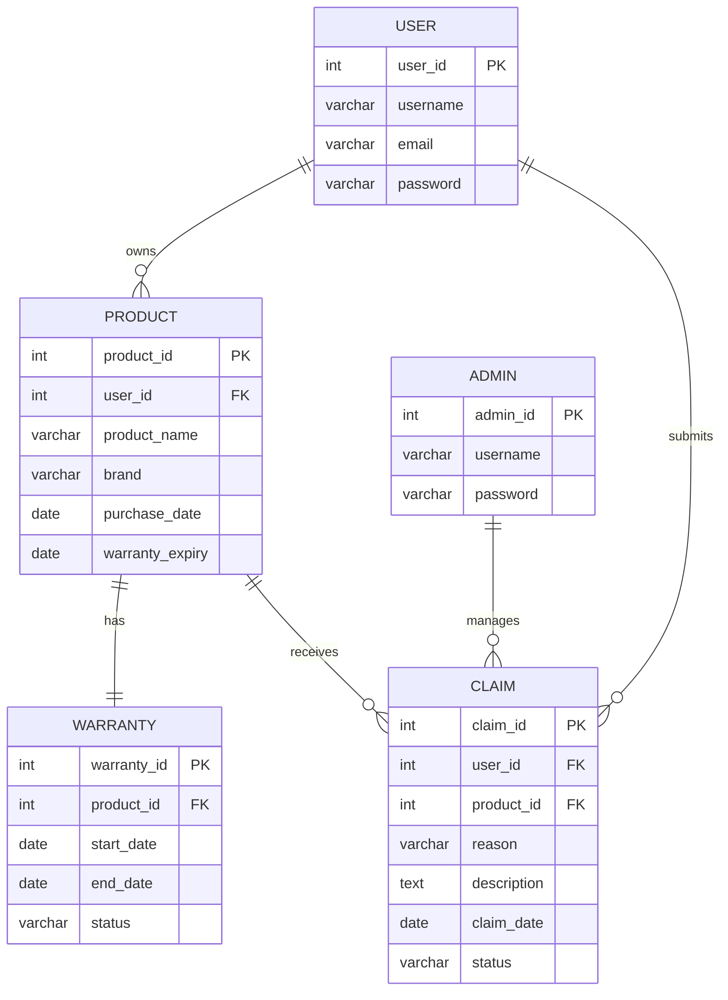

```mermaid
erDiagram

    USER {
        int user_id PK
        varchar username
        varchar email
        varchar password
    }

    PRODUCT {
        int product_id PK
        int user_id FK
        varchar product_name
        varchar brand
        date purchase_date
        date warranty_expiry
    }

    WARRANTY {
        int warranty_id PK
        int product_id FK
        date start_date
        date end_date
        varchar status
    }

    CLAIM {
        int claim_id PK
        int user_id FK
        int product_id FK
        varchar reason
        text description
        date claim_date
        varchar status
    }

    ADMIN {
        int admin_id PK
        varchar username
        varchar password
    }

    USER ||--o{ PRODUCT : owns
    PRODUCT ||--|| WARRANTY : has
    USER ||--o{ CLAIM : submits
    PRODUCT ||--o{ CLAIM : receives
    ADMIN ||--o{ CLAIM : manages
```