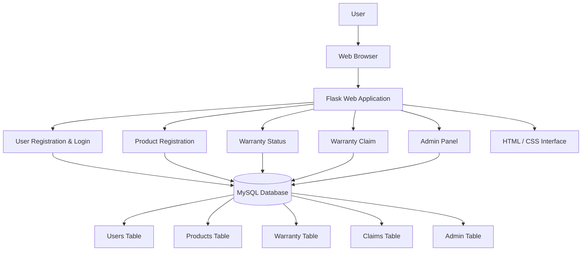

```mermaid
flowchart TD

    A[User] --> B[Web Browser]

    B --> C[Flask Web Application]

    C --> D[User Registration & Login]
    C --> E[Product Registration]
    C --> F[Warranty Status]
    C --> G[Warranty Claim]
    C --> H[Admin Panel]

    D --> I[(MySQL Database)]
    E --> I
    F --> I
    G --> I
    H --> I

    I --> J[Users Table]
    I --> K[Products Table]
    I --> L[Warranty Table]
    I --> M[Claims Table]
    I --> N[Admin Table]

    C --> O[HTML / CSS Interface]
```